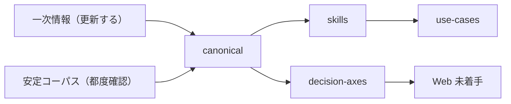

# ai-design-advisor

**Generative AI Tool to Support Design Decisions**

生成AIシステムの設計判断を支援するツール。  
ドメイン知識が豊富な業務側の人が、ある程度の指針を揢んだ上でベンダーに依頼できるようにすることを目指す。

## 目的

- ユースケースを入力すると、推奨される設計構成を提示する
- 判断軸を共通言語とする
- 用語の理解から意思決定支援へ

## 想定ユーザー

- ベンダーに依頼する業務側・企画
- PdM / 企画
- 構成を素早く切りたいエンジニア

## 提供形態

1. **スキル版**（優先）— [`skills/ai-design-advisor/SKILL.md`](./skills/ai-design-advisor/SKILL.md)
2. **構造化チェックリスト Web**（後続）— 出力型はスキルと同一。項目は [`knowledge/decision-axes/`](./knowledge/decision-axes/)

## 現状

- [x] canonical（D1–D9 + X。D7 は要否のみ。手法・運用は未精査）
- [x] スキルの出力スケルトン
- [x] UC01–23（スターター + 組成 + 事例メモ）
- [x] ユースケースメモと Issue 型
- [x] decision-axes（チェック項目 first-pass）
- [ ] 追加メモ / 実案件で調整
- [ ] Web アプリ

## 知識の流れ

スキルが読むのは canonical だけ。図と一次情報の追加・更新・削除は [`knowledge/LIFECYCLE.md`](./knowledge/LIFECYCLE.md)。

- 一次情報: [`knowledge/primary-sources/`](./knowledge/primary-sources/) と [`knowledge/sources/`](./knowledge/sources/)
- 安定コーパス: [`knowledge/stable-corpus/`](./knowledge/stable-corpus/)
- 次元: [`knowledge/SYSTEMATIC-FRAMEWORK.md`](./knowledge/SYSTEMATIC-FRAMEWORK.md)
- ユースケース: [`knowledge/use-cases/`](./knowledge/use-cases/)
- チェック項目: [`knowledge/decision-axes/`](./knowledge/decision-axes/)
- 出力契約: [`skills/ai-design-advisor/OUTPUT-SKELETON.md`](./skills/ai-design-advisor/OUTPUT-SKELETON.md)

## 関連

- [understanding-llm-through-claude-code](https://github.com/shuji-bonji/understanding-llm-through-claude-code)
- [ai-agent-architecture](https://github.com/shuji-bonji/ai-agent-architecture)
- [factcheck-skill](https://github.com/shuji-bonji/factcheck-skill) / [fact-checklist](https://github.com/shuji-bonji/fact-checklist)
