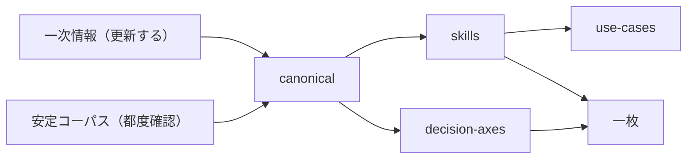

# ai-design-advisor

**Generative AI Tool to Support Design Decisions**

生成AIシステムの設計判断を支援するツール。  
ドメイン知識が豊富な業務側の人が、決まっていないことを名指したうえでベンダーに依頼できるようにすることを目指す。

価値の中心は推奨スタックではなく、**入力が足りないときに発明しないこと**。

## 目的

- ユースケースを入力すると、言えること / 言えないこと / 確認してほしいことを返す
- 判断軸を共通言語とする
- 用語の理解から意思決定支援へ

## 想定ユーザー

- ベンダーに依頼する業務側・企画
- PdM / 企画
- 構成を素早く切りたいエンジニア

## 提供形態

1. **スキル版**（優先）— [`skills/ai-design-advisor/SKILL.md`](./skills/ai-design-advisor/SKILL.md)
2. **設問セット** — [`knowledge/decision-axes/QUESTIONS.md`](./knowledge/decision-axes/QUESTIONS.md)
3. **持って行ける一枚** — [`knowledge/one-pager/`](./knowledge/one-pager/)。決まっていること／決まっていないこと／確認すること。スキル出力の HTML 化はしない

### Claude Code で使う

カタログは [`shuji-bonji/claude-plugins`](https://github.com/shuji-bonji/claude-plugins)。このリポジトリに `marketplace.json` は置かない。

スキルは `knowledge/canonical/` を読む。作業ディレクトリはこのリポジトリのルート。

```
/plugin marketplace add shuji-bonji/claude-plugins
/plugin install ai-design-advisor@shuji-bonji
```

クローン済みなら:

```
claude --plugin-dir .
```

入力は対象と前提だけ。UC ファイルの「いま言えること」以降は渡さない。

## 現状

- [x] canonical（D1–D9 + X。D7 は要否のみ。手法・運用は未精査）
- [x] スキルの出力スケルトン（確認論点を先に）
- [x] UC01–23（スターター + 組成 + 事例メモ）。一貫性チェックであり成否検証ではない
- [x] ユースケースメモと Issue 型
- [x] decision-axes（CHECKLIST / BRANCHES / QUESTIONS）
- [x] 手元メモは UC23 まで（再開は MEMO / Issue）
- [x] Claude Code プラグイン定義（`.claude-plugin/plugin.json`）
- [x] 持って行ける一枚（型 + UC01 / UC06 見本。Web はしない）
- [x] 根拠 ID（canonical の安定 ID）と、出力の検算（`scripts/check-output.mjs`）
- [ ] 素のモデルとの比較（手順と 2026-09-01 実行あり。他モデルは任意）

## 知識の流れ


```mermaid
flowchart LR
  P["一次情報（更新する）"] --> C[canonical]
  S["安定コーパス（都度確認）"] --> C
  C --> K[skills]
  C --> A[decision-axes]
  K --> U[use-cases]
  K --> W["一枚"]
  A --> W
```

スキルが読むのは canonical だけ。図と一次情報の追加・更新・削除は [`knowledge/LIFECYCLE.md`](./knowledge/LIFECYCLE.md)。

- 一次情報: [`knowledge/primary-sources/`](./knowledge/primary-sources/) と [`knowledge/sources/`](./knowledge/sources/)
- 安定コーパス: [`knowledge/stable-corpus/`](./knowledge/stable-corpus/)
- 次元: [`knowledge/SYSTEMATIC-FRAMEWORK.md`](./knowledge/SYSTEMATIC-FRAMEWORK.md)
- ユースケース: [`knowledge/use-cases/`](./knowledge/use-cases/)
- チェック項目: [`knowledge/decision-axes/`](./knowledge/decision-axes/)
- 一枚: [`knowledge/one-pager/`](./knowledge/one-pager/)
- 出力契約: [`skills/ai-design-advisor/OUTPUT-SKELETON.md`](./skills/ai-design-advisor/OUTPUT-SKELETON.md)
- ノート ID: [`knowledge/canonical/_ids.md`](./knowledge/canonical/_ids.md)

## 出力の検算

スキルの出力は、次元表の「根拠」列に canonical の**ノート ID** を書きます。ID が実在するかはコードで突合します。

```sh
node scripts/check-output.mjs knowledge/use-cases/uc01-consumer-faq.md
node scripts/check-output.mjs --list          # ID 一覧
node scripts/check-output.mjs --strict <file> # 警告も失敗にする
```

終了コードは 0（エラーなし）/ 1（存在しない ID・語彙外の確度・根拠のない「確定」）/ 2（canonical を読めず判定不能）です。
2 を 1 と分けているのは、**測れなかったことを「一致」に混ぜない**ためです。

`knowledge/use-cases/` は `--strict` で通る状態を保ちます。確度が「条件付き」「情報不足」の行は、表の直後にその次元の理由を一文書く決まりだからです。既定を `--strict` にはしていません。スキルが生成した直後の出力は理由がまだ埋まっていないことがあり、そこで止めたくないためです。

## 関連

- [understanding-llm-through-claude-code](https://github.com/shuji-bonji/understanding-llm-through-claude-code)
- [ai-agent-architecture](https://github.com/shuji-bonji/ai-agent-architecture)
- [claude-plugins](https://github.com/shuji-bonji/claude-plugins)
- [factcheck-skill](https://github.com/shuji-bonji/factcheck-skill) / [fact-checklist](https://github.com/shuji-bonji/fact-checklist)
