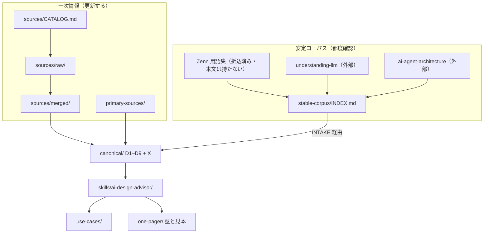

# 構成とライフサイクル

次元の定義は [`SYSTEMATIC-FRAMEWORK.md`](./SYSTEMATIC-FRAMEWORK.md)。  
抽出の型は [`sources/PIPELINE.md`](./sources/PIPELINE.md)。  
安定コーパスの取込は [`stable-corpus/INTAKE.md`](./stable-corpus/INTAKE.md)。

---

## 構成

スキルが読むのは `canonical/` だけ。倉庫と索引は推奨に使わない。
一枚は完全出力から落とす。canonical にしない。

---

## 一次情報の生涯

対象: 公式・標準・公的。`CATALOG.md` が入り口。

### 追加

1. `sources/CATALOG.md` に資料名・URL・補う穴を書く
2. `sources/raw/<id>/` に claim だけ抽く（まだ他ソースと混ぜない）
3. [`PIPELINE.md`](./sources/PIPELINE.md) でクラスタ → 検証
4. 通ったものだけ既存の canonical ノートへ折り込む。新しい判断問が生まれたときだけノートを増やす
5. 必要なら `_index.md` を更新する
6. 手書き要約が要るときだけ `primary-sources/` も直す

### 更新

1. 公式の日付・版を見る（Effort / OWASP 年次 / 事業者GL など）
2. 差分だけ再抽出する。raw の `retrieved` を書き換える
3. 既存 claim と比べる
   - 判断が変わった → クラスタと canonical を直す
   - モデル名や機器名だけ → 倉庫だけ更新。推奨に乗せない
   - 矛盾 → `agreement: 矛盾` のまま残し、canonical では確定しない
4. スキル文はノートが変わったときだけ触る

### 削除（廃止）

1. 公式が収めた、または新しい公式が否定した
2. クラスタを `rejected` にし、`reject_reason` を残す
3. canonical からその推奨を外す。孤独した文を残さない
4. raw は消さない（証跡）
5. `_index.md` と必要ならスキルの読む先を直す

---

## やらないこと

- 一次情報の更新を契機に安定コーパスを再読みしない
- 515 件や Lens 全設問を canonical にしない
- スキルが raw / merged / 安定コーパスを直接読まない
